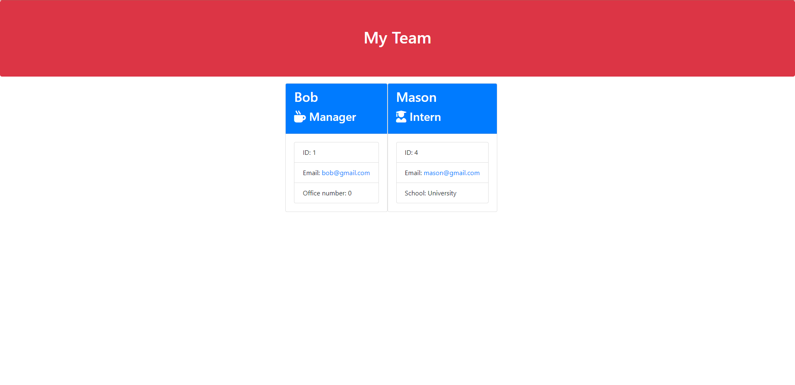

# Challenge 10: Team Profile Generator

In this weeks challenge we've used Node.js to generate a webpage that displays different team members. Users input information in the command line when prompted and when done a html file is generated. 

## Installation: 
npm install node

## Screenshot of HTML: 

## Link to walkthrough video: 
https://whttps://youtu.be/D8Qo_JcKCWwatch.screencastify.com/v/8jFpTx6LkjvKOe61wL0D
